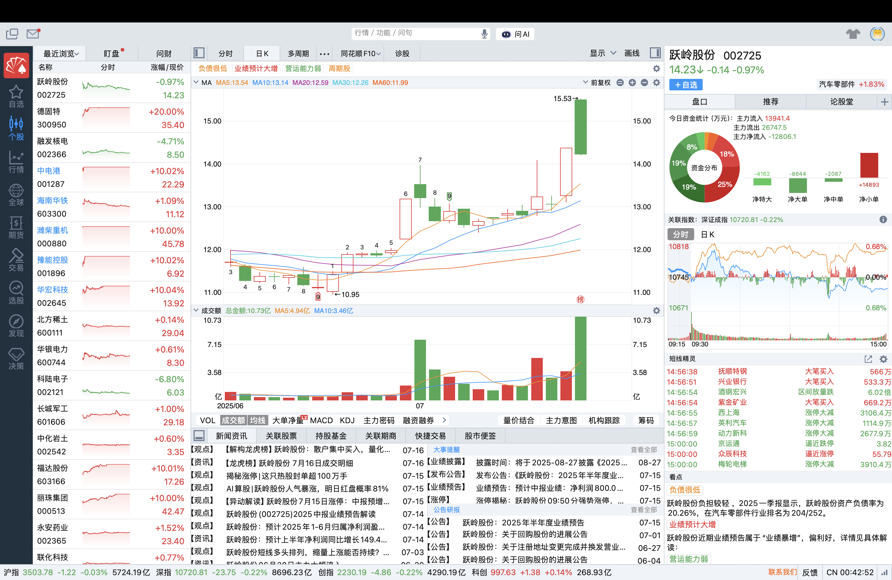

## 250717 分析

### 1. 越岭股份

新能源车，5G

这个票昨天9:50涨停封板，且一天未开板。今天似乎在拉升时买入打板。

7个点开盘直接砸到水下，但是在拉升后依然选择买入。

### 2. 国晟科技

光伏电池

昨天跌停，开板拉到-3个点，但是最后重新跌停。今天继续低开。

仍选择买入。(不理解为什么)

### 3. 景嘉微

军工，华为欧拉

今日放量，1.4亿的买入。立刻跟进。

