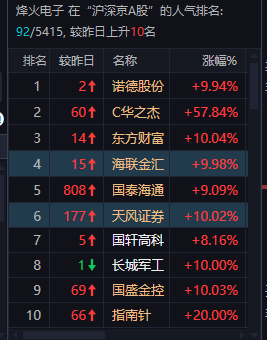
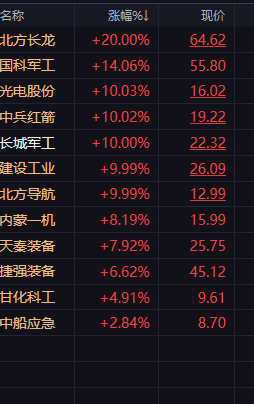
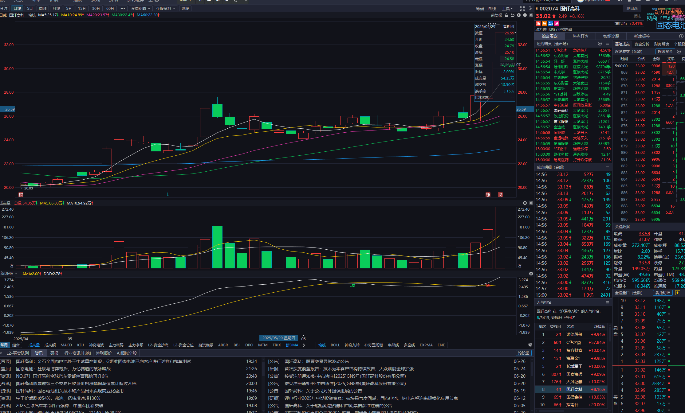
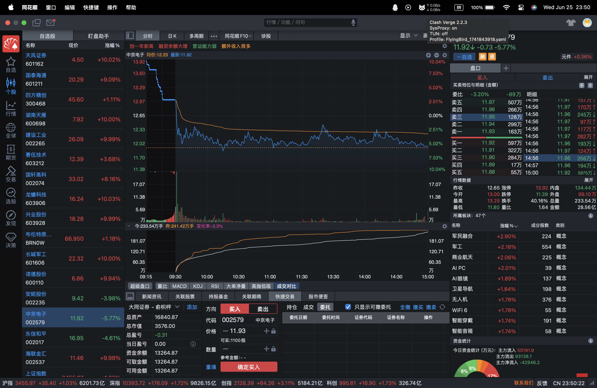

## 250625复盘分析

#### spectre今日操作
清仓长城军工，走早了    军工股依然强势，上午回封，没有再开版，目前持仓烽火电子。

#### BottleFish今日操作

清仓长城军工，卖飞了  军工强势，但是没找到买点。

依然抱有对中京电子的希望，基于中京电子40的换手，最终在收盘集合竞价时买入

### 1.券商普涨，可能是牛市启动。

**天风证券** 热度很高，证券的大妖股

### 2.军工

明天关注建设工业，长城

长城低开如果竞价强于建设工业，可以考虑买入长城军工，反之则考虑建设工业。

湖南天雁、中兵红箭、中光学、北方导航涨停，内蒙一机8个点，也可关注

捷强6个点，并不强势，上不去，但是可以关注未来走向
### 3.固态电池

国轩高科并没有封板，陈小群买入4亿。
诺德股份强势涨停，7连扳，板块强势，金龙鱼，龙蟠科技也强势

湘潭电化一字涨停，5连板，也强势

### 4.油气
路边一条

### 5.PCB
诺德涨停，但是中京电子-5个点。初步判断诺德涨是因为电池。PCB并不强势

但是由于中京电子有40的换手，依然可以关注

### 6. 稳定币
吉大一字涨停，海联涨停。但是这波牛市也可能和稳定币沾点关系，未来走势不清楚，可能是高位换手

