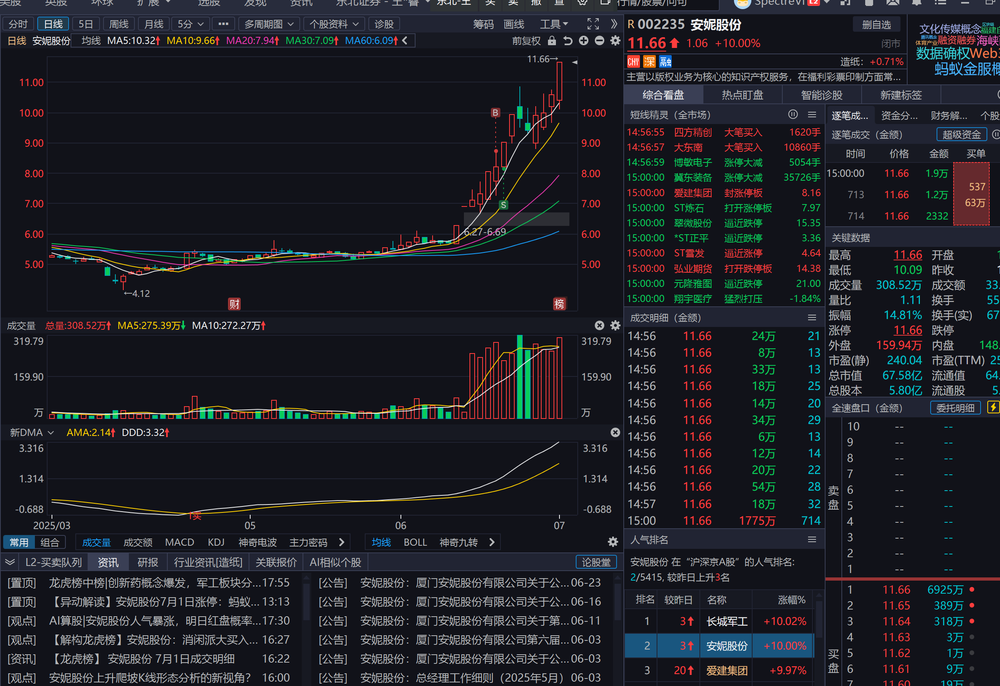
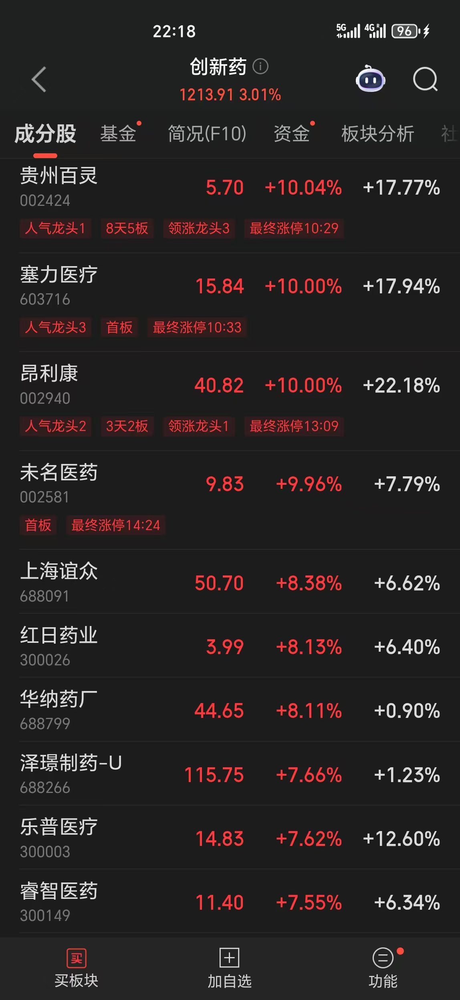
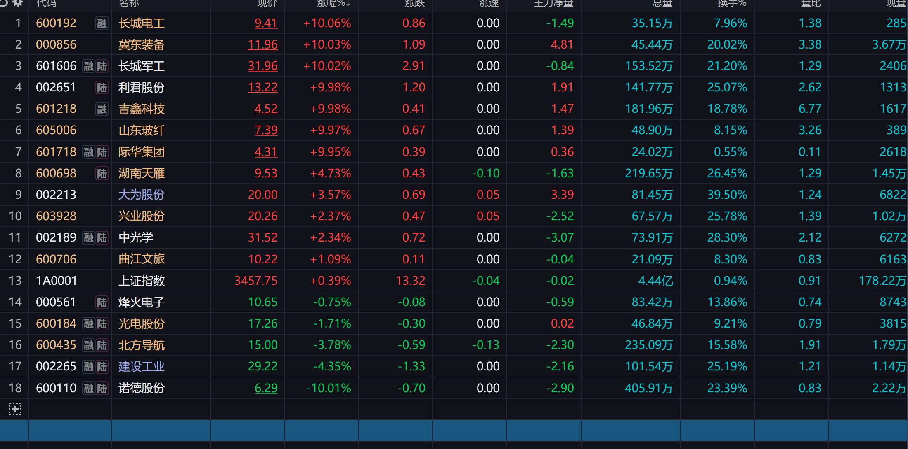

## 250629复盘分析

#### BottleFish操作

中京电子走的早，依然有利润。
建设工业下午拉升的时候卖，卖点还可以，顶住了上午的压力。（但似乎这并不好，容易亏的更多）

### 1.军工由弱转强，判断军工为本月主线，

长城军工顶住异动继续封板，军工所有龙头尾盘急拉

建设工业尾盘急拉后又下砸到-4个点，应该是庄在出货。这个票BottleFish暂时不看好。

际华集团3连板，2天1字板，可以关注，且这两天的1字板基本没量。

军工 BottleFish 认为要看早盘情况，长城明天能不能顶住异动或者其他股票能不能顶上。

### 2.芯片

大为股份为芯片与汽车概念，今天新高，判断可能明天继续走强。

### 3.固态电池

整体走弱

### 4.稳定币依然轮动涨停

### 5. 商旅
曲江文旅和南京商旅可以稍微关注。

### 6. 创新药
贵州百灵（这票有点抽象）塞力医疗，昂利康均涨停。但是是因为今日有利好。
明天还得看，不好说还有没有趋势

### 7. PCB
中京电子一路走低，几乎跌停。龙虎榜上全是T王，人气依然很高。可以关注，但现在似乎不是买点。

### 8. 其他

发现一只票叫做长城电工，可以关注

冀东装备，老妖股，属于军工概念

目前spectre关注

