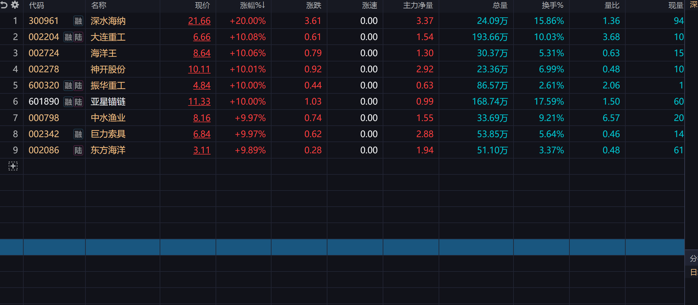

## 250629复盘分析

#### BottleFish操作
买入湖南天雁，但是尾盘炸板降到6个点，明天需要早点走。

### 1. 军工
军工由于长城军工监管，全部走弱。

### 2. 海洋
亚星锚链热榜第一，巨力索具热榜第3，有可能成为新龙头。但是仍需判断，明天开盘需重点关注这两只股票，有机会可以进。

亚星锚链明天可能会破11.52的新高。会有一定的压力，想进买点可能会有很多。
巨力索具已经持平高点。

